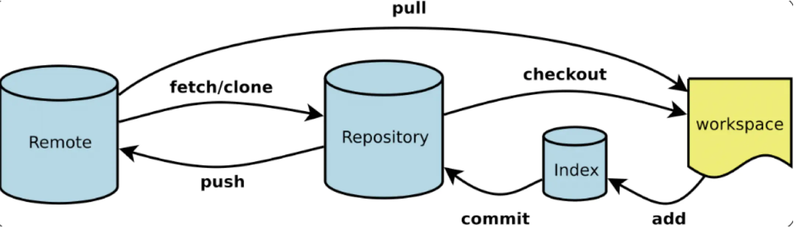

## Git下载安装与环境配置
- 官网下载->淘宝镜像
- 安装配置默认
- 环境变量Git\cmd(自动配置 非必要)
## 常用Linux命令
- cd.. 回到上级目录
- cd path 进入到path
- pwd 显示当前目录
- clear 清屏
- ls 显示当前路径的所有文件
  - 白色：文件
  - 绿色：可执行文件
  - 蓝色：文件夹
- touch git.md 新建文件git.md
- rm git.md 删除文件git.md
- mkdir gitcode 创建文件夹gitcode
- rm -r gitcode 删除文件夹gitcode
  - rm -rf / 删库跑路 -r递归删除文件夹内容,-f 强制，/根目录(切忌)
- mv git.md gitcode 将文件git.md移动到文件夹gitcode
- reset 重启
- history 历史命令
- help history 了解命令history的详细信息
- exit 退出
- \# 注释(没用)
## Git必要配置
- 查看配置
  - git config -l 系统配置+用户配置
  - git config --system --list 系统配置
  - git config --global --list 全局配置(用户配置)-必须
- 配置文件在本地 
  - Git\etc\gitconfig 系统配置
  - C:\Users\geh20\\.gitconfig 用户配置(可以清空)
- 用户配置添加(引号非必要)
  - git config --global user.name "geh"
  - git config --global user.email "1780465535qq.com"
- 用户配置删除
  - 清空配置文件 C:\Users\geh20\\.gitconfig
  - git config --global --unset user.name
  - git config --global --unset user.email
  - git config --global --unset credential.helper
  - git config --global --unset-all(全部删除)
## Git工作原理
- 工作区域
  - Working Directory 工作目录(本地)
  - Stage/Index 暂存区
  - Repository 资源库(本地git仓库)
  - Remote Directory 远程git仓库
- 转换关系
  
## Git常用
- 创建仓库(2种创建方式)
  - git init 初始化本地仓库
  - git clone 将远程仓库克隆到本地
  - .git 隐藏文件夹表示仓库创建成功
- 文件4种状态(待理解)
  - untracked 新添加的文件未add
  - unmodify
  - modified
  - staged
- 查看文件状态
  - git status 查看所有文件状态
  - git status filename 查看指定文件的状态
  - git add filename 
  - git add . 添加所有文件到暂存区
  - git commit -m "message" 将暂存区的文件提交到本地仓库 -m 提交文件的说明
- 忽略文件
  - 在工作目录中新建.gitignore文件 
  ```
  *.txt(忽略所有txt文件)
  !lib.txt(但lib.txt除外)
  /temp(忽略该目录下的文件,但子目录/temp除外)
  build/(忽略build/目录下的所有文件)
  doc/*.txt(会忽略doc/note.txt,但不会忽略doc/tet/ll.txt)
  # 表示注释
  ```
## github gitee的使用
- 免密登录-SSH公钥(本地->远程)
  - 任意位置打开git bash:ssh-keygen生成公钥
  - 一路回车自动创建.ssh文件夹
  - C:\Users\geh20\.ssh 内有公钥和密钥
  - ssh-keygen默认加密方式为rsa
  - 也可以 ssh-keygen -t rsa 指定加密方式为rsa
  - code打开C:\Users\geh20\.ssh\id_rsa.pub将文件内容复制到gitee的ssh公钥
- 远程仓库和本地仓库的连接
  - gitee新建仓库并设置为开源
  - 如果不开源的话不能clone(需要为PC设置证书)
  - gitee新建的时候不能开源，创建好之后再设置为开源
  - git clone url(https://gitee.com/geh20/git_study.git)
  - 在我的gitcode文件夹中git clone
  - 我并没有git init 所以gitcode不是一个git仓库
  - 但是git_study已经是一个git仓库了,因为远程的仓库已经建好了,不用再git init了
  - 按道理来讲,git clone之后远程仓库就已经和本地克隆好的仓库建立了连接,之后再push就好了
## Git 分支
- 常用命令
  - git branch 查看本地所有分支
  - git branch -r 查看远程所有分支
  - git branch -a 查看所有分支
  - git branch dev 新建分支dev
  - git checkout dev 切换到分支dev
  - git branch -b pre 新建分支pre并切换
  - git branch -d pre 删除分支pre
  - git merge dev 将分支dev合并到当前分支master
  - git push origin --delete dev 删除远程分支dev
- 示例
  - git checkout dev
  - touch pre.txt
  - 将其add commit之后
  - 远程分支只有一个master
  - push到master之后发现根本就没有pre.txt
  - git checkout master
  - git merge dev
  - 此时再git push origin master发现远程有pre.txt
  - git checkout dev 切换分支到dev
  - git push origin dev 在远程新建分支dev而且将本地dev分支的内容push上去了
  - 此时git status -r 发现远程已经有了master和dev
  - 其实远程的分支命名可以不是dev
  - 即git push origin dev111:dev表示远程分支dev111和本地分支dev相连接，而之前git push origin master之后发现没有pre.txt文件的原因就是远程master和本地的master相连接，所以在dev分支去push master肯定会失败
## IDEA 集成Git(之后再学吧)
- git相关内容在gitee网页下方可以找到

## FAQ
- gitee默认主分支为master,github主分支为main
- git bash提示changes not staged,只需要add就行